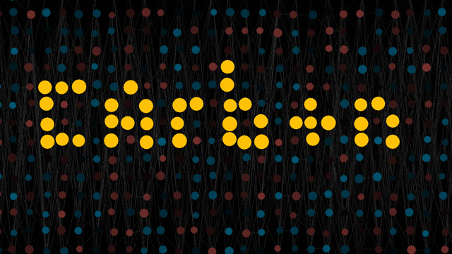

# carbon

This is a Python toolkit that bundles handy utility functions such as color interpolations, activation functions, Perlin noise, and others. The aim is to build them from the ground up to help understand how they work.

*Quick Tip*: If you're here because you need to run a specific project that uses this module, you can jump directly to the **Installation** section.




## Installation

- Manual:

    1. Download the latest `stable` version of this repository from the [releases](https://github.com/nvfp/carbon/releases) section.
    2. Remove the version number (`carbon-1.x.x` -> `carbon`).
    3. Place it in a folder where Python can recognize it as a module (e.g. `~/code/carbon`).
    4. Install dependencies:

        - libraries:

            ```sh
            pip install -r /path/to/carbon/requirements.txt
            ```

            or navigate to the `carbon` folder:

            ```sh
            pip install -r requirements.txt
            ```
        - [FFmpeg](https://ffmpeg.org/download.html) (optional, if the project needs it. Any version should be okay, but version 5 or latest is recommended)


## Usage

- check the version:

    ```sh
    python carbon -v
    ```

- Basic:

    ```python
    from carbon.ffmpeg import get_audio_sample_rate
    from carbon.gui.button import Button
    from carbon.time import get_sexagecimal
    from carbon.utils import minmax_normalization
    ```

- Testing:

    ```sh
    python -m unittest
    ```

    ```sh
    python carbon\_testing\noise#__init__.py#perlin_noise_1d.py
    ```


## Compatibility purposes

TL;DR: It's recommended to always use the latest version.

Sometimes, when I need to add a feature or make big changes, I find starting over is the least stressful way to ensure older projects don't break. Here's how I manage the generations across the module.

**Minor** (argument order, scaling, generalization, etc.):
- `carbon.mdl.fn` -> `carbon.mdl.fn2`
- `carbon.mdl.fn` -> `carbon.mdl.v2.fn`

**Major** (data structure, component relations, overall usage, etc.):
- `carbon.mdl.Class` -> `carbon.mdl_v2.Class`
- `carbon.module` -> `carbon.module_new_name`

Mostly, basic functions (standalone, input-in-output-out) are the ones that undergo **Minor** changes. **Major** changes are mostly expected in structured things like big modules (interconnected functions, specific usage rules).


## FAQ

- Compatibility:

    Latest version is always compatible with older versions (e.g., `carbon-1.3.0` works with projects that use `carbon-1.0.0` or `carbon-1.2.0`)


## Changelog

- 1.4.0 (June 11, 2023):
    - added unittest for `carbon/color`
    - `carbon/color`: added `getgray`, `rgb_to_hex`, `hexa_to_hex`
- 1.3.1 (May 27, 2023):
    - Added `.gitkeep` into `carbon/_testing/_empty_dir`
- 1.3.0 (May 27, 2023):
    - New: `carbon.neuralnet.genetic`
    - Added `carbon.gui.button.v3`
    - Added `carbon.gui.label.v2`
    - Added `carbon.gui.slider.v2`
- 1.2.0 (May 12-20, 2023):
    - Updated `carbon.graph.graph2d.graph2d`: `carbon.graph.graph2d.v2`
    - Updated `carbon.gui.button`: `carbon.gui.button.v2`
    - Added `carbon/neuralnet/dense`
    - Added `carbon/math`
    - Added `carbon/path`
    - Added `carbon/color`
    - Added `carbon/gui/shape`
    - Added `carbon/keycrate`
    - Added `open_file` to `carbon/path`
    - Added `get_gray` to `carbon/color`
    - Added `get_angle` and `rotate_coordinate` to `carbon/math`
    - Added `map_range`, `printer` and `is_valid_var_name` to `carbon/utils`
    - New methods for `carbon.gui.label.Label`: `set_font`, `set_font_by_id`, `set_fg`, `set_fg_by_id`
- 1.1.1 (2023 May 7):
    - Resolved the conflict between `Button.tags` and `self.tags`.
    - Added new arguments to `carbon.gui.label.Label` (`bd`, `bd_width`, `wraplength`, `padx`, `pady`)
- 1.1.0 (2023 May 4):
    - added `carbon/quick_visual`, `carbon/graph`, and `carbon/noise` modules


## Troubleshoot

- If Python can't find the module, as indicated by `ModuleNotFoundError: No module named 'carbon'`, try putting it in Python's standard folder for external libraries (`~/Python3/Lib/site-packages`).
- To report bugs/issues or ask questions, you can reach me [here](https://nvfp.github.io/contact) or open an issue/pull request.


## License

This project is licensed under the MIT license.